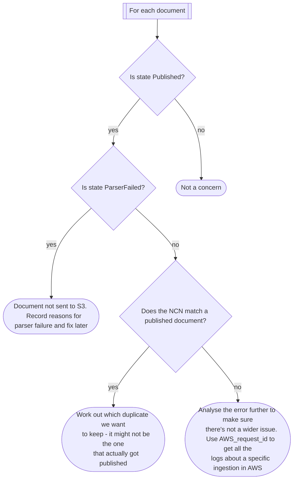

# Wider Bulk Upload process

<!-- TOC -->
* [Wider Bulk Upload process](#wider-bulk-upload-process)
  * [Bulk ingestion events](#bulk-ingestion-events-)
  * [Running a bulk upload](#running-a-bulk-upload)
  * [Verifying document status after a bulk upload](#verifying-document-status-after-a-bulk-upload)
    * [Get logs](#get-logs)
      * [Backlog tracker db](#backlog-tracker-db)
      * [AWS Ingester logs](#aws-ingester-logs)
      * [MarkLogic logs](#marklogic-logs)
    * [Consolidating log CSVs with DuckDB](#consolidating-log-csvs-with-duckdb)
    * [Analysing the logs](#analysing-the-logs)
<!-- TOC -->

The Bulk upload process is triggered by the backlog parser but runs through multiple services. 

When bulk uploading a batch we need to:

- Ensure inputs are valid (see [internal documentation](https://national-archives.atlassian.net/wiki/spaces/DFCL/pages/1437794305/))
- Run a batch through the parser (see [readme backlog parser instructions](../README.md#backlog-parser))
- See where in the overall process each document got to so we can:
  - Rerun transient failures
  - Ensure that the correct documents are getting published
  - Catalog / fix other errors

## Bulk ingestion events  

  ```mermaid
  graph TD

    subgraph Log locations
      direction LR  
      tracker[Parser tracker db]
      cloudwatch[AWS Cloudwatch logs]
      marklogic[Marklogic query]
    end
    tracker -.- backlog_Parser 
    subgraph backlog_Parser [Backlog parser]
      parse_csv[Parse external csv metadata]
      parse_doc[Parse document]
      build_stub[Build stub]
      write_output[Write output locally]
      upload_to_s3[Upload to S3 bulk ingest bucket]
      
      parse_csv -- if docx --> parse_doc
      parse_csv -- if pdf --> build_stub

      parse_doc & build_stub --> write_output --> upload_to_s3
    end

    cloudwatch -.- sns_topic[SNS] & sqs_queue[SQS]
    backlog_Parser -- object creation event --> sns_topic
    sns_topic --> sqs_queue
    sqs_queue --> lambda_triggered

    cloudwatch -.- Ingester
    subgraph Ingester [Ingester]
      lambda_triggered[Lambda triggered]
      retrieve_doc[Retrieve document from s3]
      ingest_doc[Ingest document]
      enrich_doc[Send for enrichment]
      publish_doc[Publish document]

      lambda_triggered --> retrieve_doc
      retrieve_doc --> ingest_doc
      ingest_doc --> publish_doc & enrich_doc
      publish_doc
    end

    ingest_doc -.-> eui([Document accessible on EUI])
    publish_doc -.-> pui([Document accessible on PUI])
    marklogic -.- eui & pui
  ```

## Running a bulk upload

Please refer to the [internal documentation](https://national-archives.atlassian.net/wiki/spaces/DFCL/pages/1437794305/) for details on the full process including retrieving and validating inputs, performing file conversions and what to look for when doing a dry run.
See [configure and run backlog parser](../README.md#backlog-parser) for details on commands and flags.

## Verifying document status after a bulk upload

### Get logs

#### Backlog tracker db

This is a SQLite db created by the backlog parser run - see [backlog parser outputs](../README.md#tracker-database)

#### AWS Ingester logs

- Go to Cloudwatch Logs Insights and filter on appropriate log group in dropdown
- Run:
    ```
    fields @requestId, @message
    | filter ispresent(@requestId)                                                                                                   
    | parse @message /(?<markLogic>d-[0-9a-f]{8}-[0-9a-f]{4}-[0-9a-f]{4}-[0-9a-f]{4}-[0-9a-f]{12})/
    | parse @message /(?<tre>[0-9a-f]{8}-[0-9a-f]{4}-[0-9a-f]{4}-[0-9a-f]{4}-[0-9a-f]{12})\.tar\.gz/                                 
    | parse @message /^\[(?<logSeverity>.*?)\]\s+(?<logTimestamp>[^ ]+?)\s+[-0-9a-f]*\s+(?<logMessage>.*?)$/                       
    | parse @message /(?<ncn>\[\d{4}\]\s+[A-Z]+\s+\d+(\s+\([A-Z0-9]+\))?)/                       
    | fields                                                                                                                         
        if(logSeverity = 'INFO',    concat(logTimestamp, ' | ', logMessage), '') as _i,                                              
        if(logSeverity = 'WARNING', concat(logTimestamp, ' | ', logMessage), '') as _w,                                              
        if(logSeverity = 'ERROR',   concat(logTimestamp, ' | ', logMessage), '') as _e                                               
    | stats                                                                                                                          
        sortsFirst(markLogic) as markLogicUri,                                                                                       
        sortsFirst(tre) as treReference,                                                                         
        sortsFirst(ncn) as ncnReference,
        sortsLast(_i) as lastInfoMessage,                                                                                            
        sortsLast(_w) as lastWarningMessage,                                                                                       
        sortsLast(_e) as lastErrorMessage,                                                                                           
        latest(@message) as lambdaReport                                                                                           
      by @requestId
    ```
- Export results to csv

#### MarkLogic logs

- Go to MarkLogic Query Console
- Run [marklogic-ingested-parser-run.xquery](./marklogic-ingested-parser-run.xquery) with parser-run-id from the tracker
- Copy results as raw text and paste into a new csv file

### Consolidating log CSVs with DuckDB

Use [DuckDB](https://duckdb.org/docs/current/clients/cli/overview) to query the csv files and consolidate into a single csv file.

```bash
brew install duckdb
```

Then run:

```bash
consolidate_bulk_logs.sh
```

### Analysing the logs

Open the consolidated csv ([OpenRefine](https://openrefine.org/) is a good tool for this) and investigate any documents that are **not** in `Published` or `ParserFailed` states. These are the documents that encountered errors during the ingestion and publishing process and could indicate wider issues.


